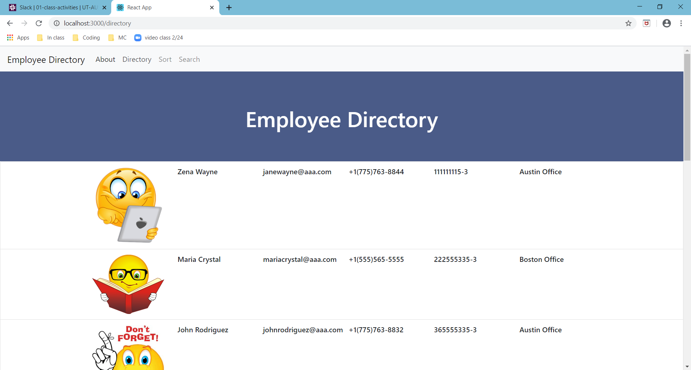
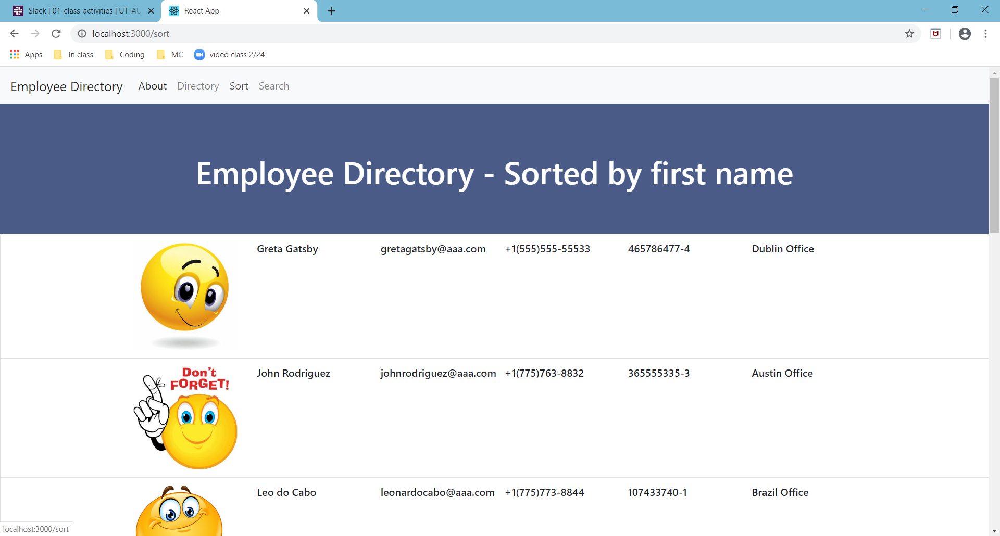

# EmployeeDirectory

The EmployeeDirectory app creates a employee directory using React. It will allow anybody to view the company's entire employee directory, with  quick access to their information.  

This assignment will require you to break up your application's UI into components, manage component state, and respond to user events.

# Motivation 
Homework 19 

# Prerequisites
The software will run in any Laptop, iPad and phone.

# Results
Application's UI was broke up into components, manage component state, and respond to user events.
When the app loads, a cover page renders with a navigations bar with links to the full directory, the sorted direectory and the search page, where a specific employee's information will be rendered. So, the user should be able to:
  * Sort the table by employee's first name.
  * Filter the users by full name (needs to be the exact full name). 

# URL to the Github repository
https://github.com/MariaDawes/EmployeeDirectory

# URL to the Deployed site

# Screenshots

# Test
  * Pages navigation tests were done. 
  * List, sort and search functionality tested. 

# Author
Maria Dawes-Tedesco

# Contributing
Please read CONTRIBUTING.md for details on our code of conduct, and the process for submitting pull requests to us.

# Versioning

For the versions available, see https://github.com/MariaDawes/Template-Engine/commits/master

# Acknowledgement

Thank you to Kevin Geary for help with the search functionality.
